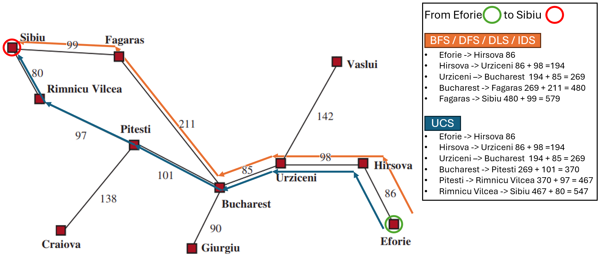

# Ejercicio 01 — Comparación de algoritmos de búsqueda no informada

## Selección de ciudades

- **Start:** Eforie
- **Goal:** Sibiu

## Resultados

| Algoritmo | Camino | Profundidad | Costo (km) | Expandidos | Generados | Estado |
|---|---|---:|---:|---:|---:|---|
| BFS | Eforie → Hirsova → Urziceni → Bucharest → Fagaras → Sibiu | 5 | 579 | 6 | 15 | Éxito |
| UCS | Eforie → Hirsova → Urziceni → Bucharest → Pitesti → Rimnicu Vilcea → Sibiu | 6 | 547 | 12 | 28 | Éxito |
| DFS | Eforie → Hirsova → Urziceni → Bucharest → Fagaras → Sibiu | 5 | 579 | 5 | 13 | Éxito |
| DLS (Límite 4) | No encontrado (se alcanzó el límite) | Límite 4 | N/A | 5 | 13 | Cutoff |
| DLS (Límite 5) | Eforie → Hirsova → Urziceni → Bucharest → Fagaras → Sibiu | 5 | 579 | 5 | 9 | Éxito |
| IDS | Eforie → Hirsova → Urziceni → Bucharest → Fagaras → Sibiu | 5 | 579 | 16 | 35 | Éxito |

## Subgrafo relevante

## Preguntas

    1.¿BFS encontró el camino con menos carreteras? ¿UCS el de menos km?

    R: Si, BFS encontró una solución con 5 caminos (roads) y un costo total de 579, mientras que UCS encontró una solución con 6 caminos (roads) sacrificando un camino adicional para entregar un costo menor de 547. entendemos esto basándonos en las condiciones de la expansión de la fronteras, mientras que el FIFO de BFS (al estar en orden alfabético) evaluara primero Fagaras y no expandirá siquiera a Pitesti aun si Pitesti fuese expandido al encontrar que Fagaras alcanza un estado objetivo con menor número de caminos BFS seleccionaría Fagaras, por lo contrario UCS con su condición de ordenar por menor costo evaluara primero Pitesti encontrara el valor de Sibiu en 547 pero continua porque aún hay nodos en la frontera menores a este valor y hasta expandir Fagaras y encontrar a Sibiu con 579 y solo cuando Sibiu 547 sea el nodo con menor costo aer seleccionada la solución, por eso existe una diferencia muy grande entre los nodos expandidos en BFS y UCS

    2.¿Por qué DFS puede devolver un camino más largo aunque el grafo sea el mismo?

    R: DFS depende mucho de la manera en el que los nodos son agregados y retirados de la frontera ya que DFS utiliza una pila tipo LIFO como método de frontera, en este caso al conocer nuestro grafo y saber que los valores entran a la frontera en orden alfabético pudimos encontrar una manera de entregar a Bucarest por encima de Vaslui y de Giurgiu y Fagaras por encima de Pitesti pero si no hubiésemos corrido con esa suerte DFS habría entregado Eforie → Hirsova → Urziceni → Bucharest → Pitesti → Rimnicu Vilcea → Sibiu como una solución valida. De igual manera habría obtenido un mayor número de nodos expandidos, si se hubiese decantado por expandir primero Vaslui.

    3.¿Con qué --limit DLS pasó de cutoff a solución, y cómo se relaciona eso con la profundidad del camino de BFS/IDS?

    R: DLS paso de cutoff a solución en el límite 5, que es exactamente el valor más corto de profundidad encontrado por IDS y por BFS. 
    

## Prueba adicional — Cambio del estado objetivo

- **Start:** Eforie
- **Goal:** Zerind

| Algoritmo | Camino | Profundidad | Costo (km) | Expandidos | Generados | Estado |
|---|---|---:|---:|---:|---:|---|
| DLS (Límite 6) | No encontrado (se alcanzó el límite) | Límite 6 | N/A | 13 | 32 | Cutoff |
| DLS (Límite 7) | Eforie → Hirsova → Urziceni → Bucharest → Fagaras → Sibiu → Arad → Zerind | 7 | 794 | 7 | 12 | Éxito |

