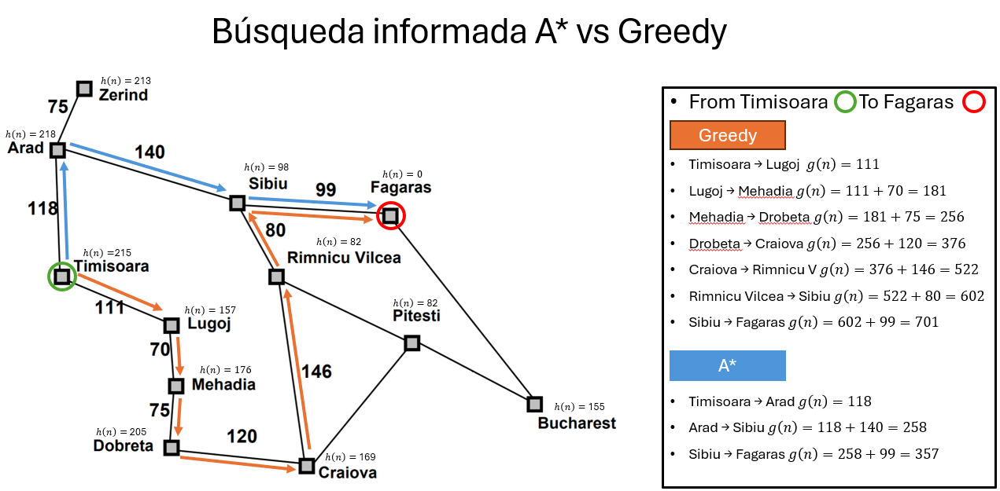
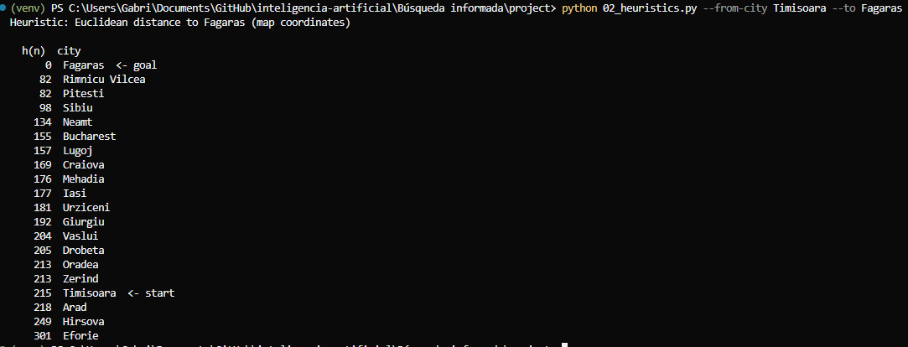
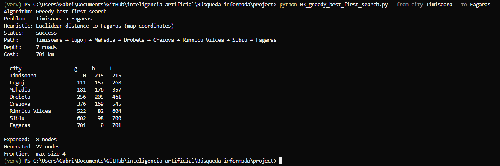
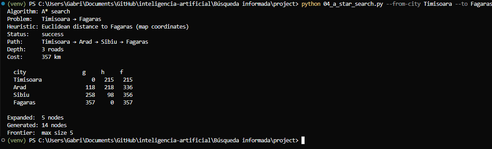
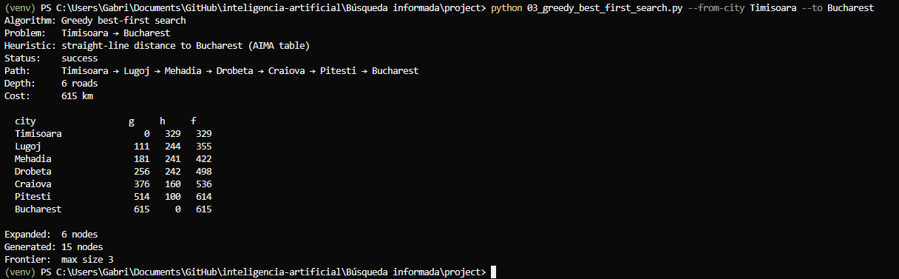

# Ejercicio 01 — Comparar Greedy y A* en el mapa de Rumania

## Selección de ciudades

- **Start:** Timisoara
- **Goal:** Fagaras

## Subgrafo relevante

## Resultados

| Algoritmo | Camino | Profundidad | Costo (km) | Expandidos | Generados | Heurística |
|---|---|---:|---:|---:|---:|---|
| Greedy Best-First | Timisoara → Lugoj → Mehadia → Drobeta → Craiova → Rimnicu Vilcea → Sibiu → Fagaras | 7 | 701 | 8 | 22 | Distancia euclidiana a Fagaras |
| A* | Timisoara → Arad → Sibiu → Fagaras | 3 | 357 | 5 | 14 | Distancia euclidiana a Fagaras |

## Preguntas

1. ¿A* encontró el camino de menor costo (km)? ¿Greedy coincidió o se desvió?

   R:Si, A* encuentra el camino mas corto o de menos costo en KM, la manera en la que A* utiliza la combinación de heurística y costo, le permitió tomar un camino casi la mitad de costoso que Greedy. Sin embargo, al principio ambos toman caminos similares entre Lugoj y Arad ambos ser deciden por Lugoj al tener menor h(n) y f(n) sin embargo A* logra corregir tras comparar su f(n) con Mehadia y Arad. Greedy, sin embargo, al no tomar en cuenta el costo, inclusive atravesó momentos donde su heurística aumento, como en Dobreta que h(n) ascendió a 205 pero seguía menor al 218 de arad que seguía en la frontera.  Lo que al final entrego un resultado total en km de 701 para greedy y 357 para A*

2. ¿Por qué Greedy puede encontrar un camino más caro aunque la heurística h(n) sea admisible?

   R:Una heurística admisible no automáticamente la vuelve optima, a pesar de que el método para definir la heurística fue exitoso usando distancias euclidianas, ya que no sobreestima el costo real. Sin embargo, Greedy no toma en cuenta el costo que ya invirtió para avanzar de un estado al otro, esto provoca que Greedy llegue a soluciones validas, pero menos optimas que A*

3. ¿Los valores de f(n) = g(n) + h(n) tienden a no disminuir a lo largo del camino encontrado por A*? ¿Cómo se relaciona esto con la consistencia de la heurística?

   R:Si, en este uso de la heurística durante todo el camino final de A* la f(n) no disminuye, empezamos en 215 de ahí 336 en Arad y 356 en Sibiu hasta 357 en Fagaras. Al avanzar una distancia g(n) esperaríamos que ese impacto se vea representado en la función f(n) ya que esta para considerar una heurística consistente f(n) debe siempre ser menor o igual a f(n’)

## Evidencias de ejecución

### Heurística

### Greedy Best-First Search

### A*

## Reto Opcional

## Cambio de Fagaras a Bucharest 

Se puede observar en la terminal que utiliza la heuristica del la tabla del libro (SLD_TO_BUCHAREST).

## Manteniendo Timisoara y cambiando a Neamt
| Algoritmo | Camino | Profundidad | Costo (km) | Expandidos | Generados | Frontera máx. |
|---|---|---:|---:|---:|---:|---:|
| Greedy Best-First | Timisoara → Arad → Sibiu → Fagaras → Bucharest → Urziceni → Vaslui → Iasi → Neamt | 8 | 974 | 11 | 30 | 8 |
| A* | Timisoara → Arad → Sibiu → Rimnicu Vilcea → Pitesti → Bucharest → Urziceni → Vaslui → Iasi → Neamt | 9 | 942 | 17 | 43 | 5 |

Este cambio es interesante por que nos describe una vez mas que no siempre un método va a ser mejor que otro y que las circunstancias pueden definir la manera de evaluar los métodos. Ahora la diferencia entre el costo de Greedy y A* es apenas de 32 sin embargo, A* expandió muchos más nodos (17 vs 11) que Greedy y genero aún más (43 vs 30), también tuvo una profundidad mayor y solo entrego una solución 32 km menor, esto dependiendo desde que ángulo se observe nos podría decir si vale o no la pena el esfuerzo adicional de A* vs el resultado tan similar.

### UCS — Timisoara → Fagaras

| Algoritmo | Camino | Profundidad | Costo (km) | Expandidos | Generados | Frontera máx. |
|---|---|---:|---:|---:|---:|---:|
| Greedy Best-First | Timisoara → Lugoj → Mehadia → Drobeta → Craiova → Rimnicu Vilcea → Sibiu → Fagaras | 7 | 701 | 8 | 22 | 4 |
| A* | Timisoara → Arad → Sibiu → Fagaras | 3 | 357 | 5 | 14 | 5 |
| UCS | Timisoara → Arad → Sibiu → Fagaras | 3 | 357 | 9 | 23 | 4 |

Si la h(n) tendiera a 0 en A* nos daríamos cuenta de que básicamente f(n) = g(n) + 0, lo que en estas condiciones seria lo mismo que UCS, sin embargo, por la tabla podemos observar que A* por esta heurística adicional es capaz de reducir el número de nodos expandidos de alguna forma volviéndolo un poco más eficiente para esta aplicación en particular. 