# Ejercicio 01 — Perceptrón Multicapa

## 1. Evidencias de ejecución

[📁 Códigos del ejercicio en Google Drive](https://drive.google.com/drive/folders/1w13soxxWGbO1MkP8VkLmOYT1wu5uV_kP)

### 1.1 Implementación a mano

| Original (4-3-3) | Profunda (4-3-3-3-3) |
|:---:|:---:|
| **Run 1** | **Run 1** |
|  |  |
| **Run 2** | **Run 2** |
|  |  |
| **Run 3** | **Run 3** |
|  |  |
| **Run 4** | **Run 4** |
|  |  |

### 1.2 Implementación con Keras

#### Resumen de los modelos

| Original (4-3-3) | Profunda (4-3-3-3-3) |
|:---:|:---:|
| 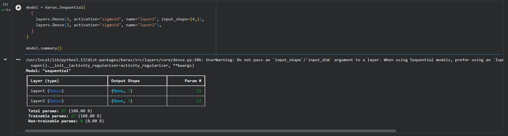 | 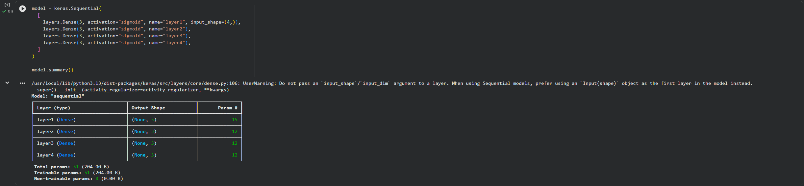 |

#### Ejecuciones

| Original (4-3-3) | Profunda (4-3-3-3-3) |
|:---:|:---:|
| **Run 1** | **Run 1** |
| 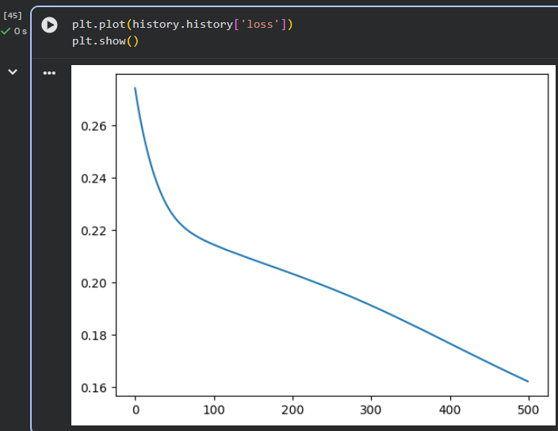 | 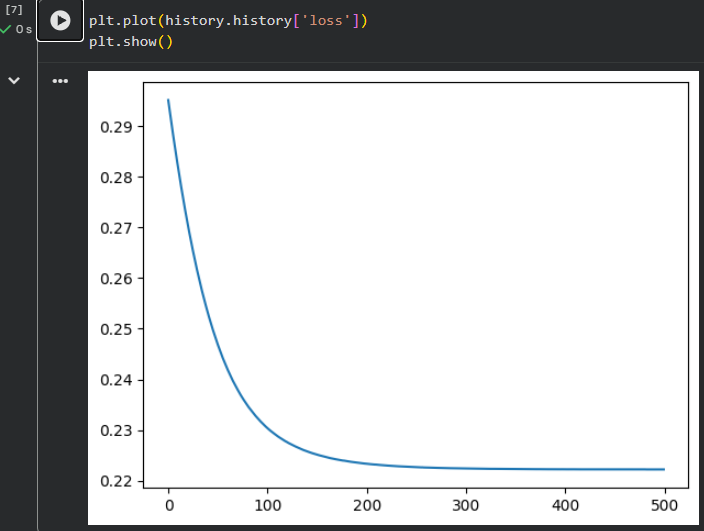 |
| **Run 2** | **Run 2** |
| 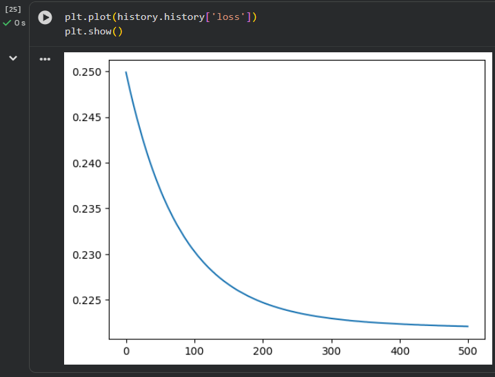 | 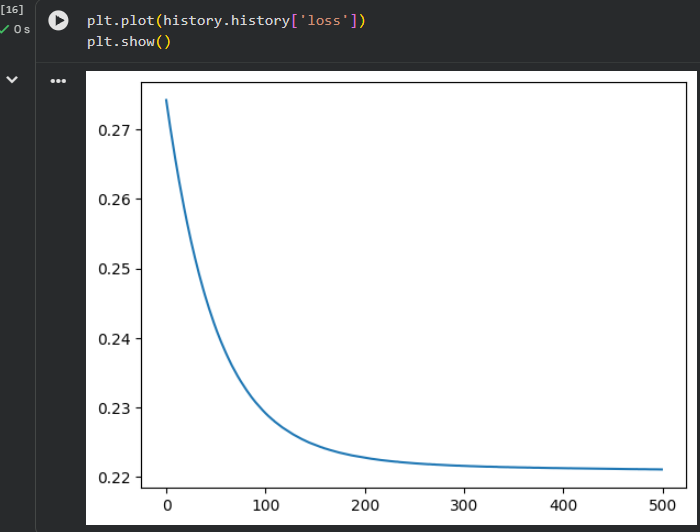 |
| **Run 3** | **Run 3** |
| 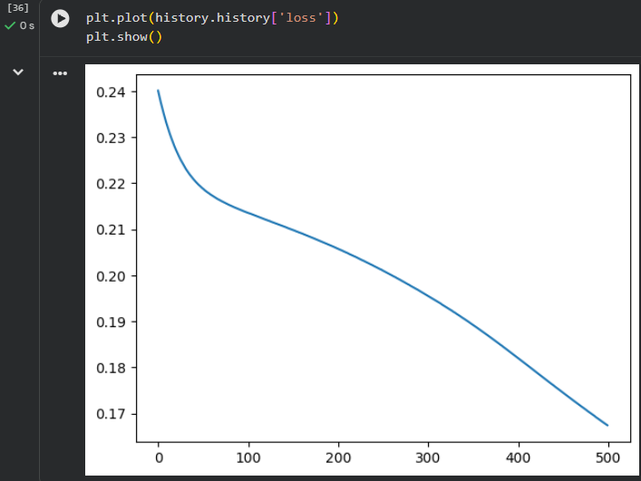 | 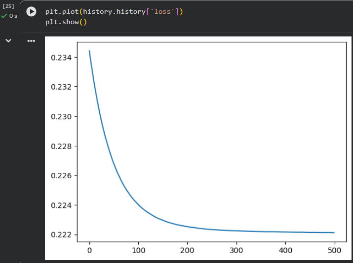 |
| **Run 4** | **Run 4** |
| 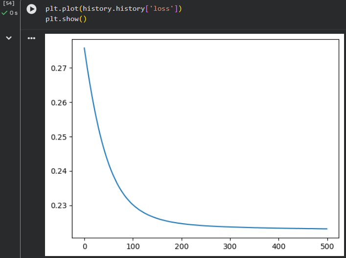 | 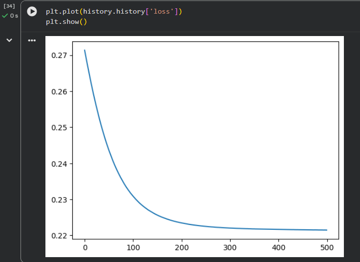 |

## 2. Comparación de resultados

### Tabla 1. Resultados experimentales — 500 épocas

| Implementación | Arquitectura | Run | Tiempo (s) | Loss final |
|---|---|---:|---:|---:|
| **Keras** | **Original (4-3-3)** | 1 | 34.4 | 0.16230 |
| **Keras** | **Original (4-3-3)** | 2 | 35.0 | 0.22210 |
| **Keras** | **Original (4-3-3)** | 3 | 35.3 | 0.16740 |
| **Keras** | **Original (4-3-3)** | 4 | 34.5 | 0.22310 |
| — | — | — | — | — |
| **Keras** | **Deep (4-3-3-3-3)** | 1 | 37.0 | 0.22220 |
| **Keras** | **Deep (4-3-3-3-3)** | 2 | 37.1 | 0.22210 |
| **Keras** | **Deep (4-3-3-3-3)** | 3 | 38.0 | 0.22210 |
| **Keras** | **Deep (4-3-3-3-3)** | 4 | 37.5 | 0.22150 |
| — | — | — | — | — |
| **Manual** | **Original (4-3-3)** | 1 | 5.14 | 0.05802 |
| **Manual** | **Original (4-3-3)** | 2 | 5.15 | 0.06430 |
| **Manual** | **Original (4-3-3)** | 3 | 5.89 | 0.05893 |
| **Manual** | **Original (4-3-3)** | 4 | 5.74 | 0.07267 |
| — | — | — | — | — |
| **Manual** | **Deep (4-3-3-3-3)** | 1 | 17.9 | 0.67063 |
| **Manual** | **Deep (4-3-3-3-3)** | 2 | 17.3 | 0.66879 |
| **Manual** | **Deep (4-3-3-3-3)** | 3 | 15.8 | 0.53463 |
| **Manual** | **Deep (4-3-3-3-3)** | 4 | 16.0 | 0.67138 |

## 3. Análisis y preguntas

### 3.1 ¿Bajó más el error al añadir dos capas, o se estancó / empeoró? ¿Igual en NumPy y en Keras?

**Respuesta:** En cuanto a la implementación a mano, se puede observar en la tabla de resultados, que al menos en estas condiciones, manteniendo épocas de 500, el Loss en la implementación profunda aumento considerablemente, de igual manera se observa en las gráficas que se llegan a mesetas largas, lo que nos podría decir que no vario mucho el Loss en múltiples iteraciones de épocas. En Keras, sin embargo, se observa que, a pesar de incrementar el número de capas utilizadas, el comportamiento del Loss se mantuvo en el mismo rango, pero hay que notar que en la implementación original Keras lograba obtener valores por debajo de .18 que no aparecen de nuevo en la topología profunda, esto nos podría servir para inferir que en Keras se estancó el Loss. Para ambos incrementar el número de capas produjo un incremento en el tiempo de procesamiento. 

### 3.2 ¿Las curvas de la notebook 01 y de Keras se parecen con la misma topología? Si no, ¿qué diferencias de implementación podrían explicarlo (orden de los datos, inicialización, vectorización, etc.)?

**Respuesta:** Si, ambas curvas inclusive con la misma topología son diferentes, esto puede ser tanto porque en la implementación a mano como la hecha con Keras, la inicialización de los pesos se realiza de manera aleatoria, que genera puntos de partida para el entrenamiento diferentes que pueden ayudar o empeorar la reducción del Loss y adicionalmente, lo que probablemente impacte más en este caso, es que en la implementación a mano, la actualización de los pesos se realiza después de cada ejemplo, mientras que en el Keras al no especificar un Batch size para el SGD este utilizara por defecto 32 muestras esto quiere decir que Keras está actualizando en grupos de 32 ejemplos aproximadamente 5 veces por época y nuestra implementación a mano 1 vez por cada ejemplo, aproximadamente 150 por época.  De igual manera los datos pasan al forward en Keras en la función fit() que utiliza shuffle para reorganizar los valores entre epocas.  

### 3.3 Con sigmoides apiladas y MSE, ¿tiene sentido que una red más profunda no aprenda mejor en Iris? Relaciónalo con lo que viste en las gráficas.

**Respuesta:** Como estamos usando el sigmoide como función de activación sabemos que a mayor profundidad la señal de Loss se multiplica por la derivada de la función sigmoide, lo que puede reducir la magnitud de la señal, que afecta principalmente a las primeras capas, haciendo que el aprendizaje sea más lento o tengan cambios muy pequeños. Tiene sentido con lo que se observa en nuestras graficas, especialmente en la implementación hecha a mano. Con la intención de comprobar esto, se realizó una ejecución de 2000 épocas en dicha implementación y se pudo observar que aproximadamente en la época 800 se reduce otra vez de manera significativa loss hasta alcanzar un valor de .044 como en las ejecuciones originales.  Esto nos dice que no necesariamente sea incapaz de aprender al aumentar el número de capas, solo nos dice que puede requerir mayor tiempo.

## 4. Reto opcional

### 4.1 Comparación de funciones de activación y número de neuronas en Keras

- **Sigmoid + MSE:** arquitectura profunda original `4-3-3-3-3`.
- **ReLU + Softmax + Categorical Crossentropy:** arquitectura `4-3-3-3-3`.
- **ReLU + Softmax + Categorical Crossentropy (8 neuronas):** arquitectura `4-8-8-8-3`.

#### Model Summaries

| Sigmoid (4-3-3-3-3) | ReLU (4-3-3-3-3) | ReLU (4-8-8-8-3) |
|:---:|:---:|:---:|
|  | 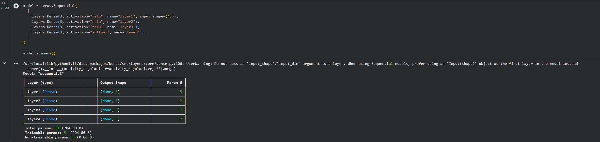 | 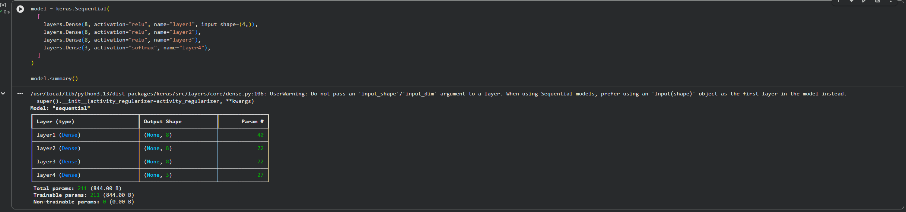 |

#### Curvas de entrenamiento

| Sigmoid + MSE (4-3-3-3-3) | ReLU + Softmax (4-3-3-3-3) | ReLU + Softmax (4-8-8-8-3) |
|:---:|:---:|:---:|
|  | 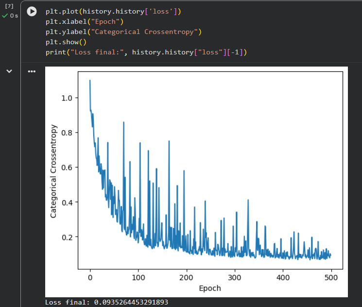 | 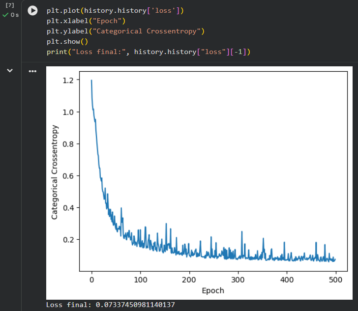 |

#### Análisis

De lo que se puede observar en las 3 graficas diferentes, la curva de ReLu parece iniciar con un error Loss 1.1 a diferencia que Sigmoid que inicia en .29 a pesar de eso ambos parecieran llegar a una loss .2 aproximadamente entre las 100 y 200 épocas, pero a pesar de que ReLu continúa reduciendo loss hasta .093 y que sigmoid se estanque en .222 no podemos comparar modelos que usan diferentes tipos de perdida para definir si uno es mejor que otro. Sin embargo, entre el ReLu de 4-3-3-3-3 y el ReLu de 4-8-8-8-3 usan el mismo tipo de perdida “Crossentropy” y entre ellos si existe una diferencia entre los 2 loss, también se observa que la amortiguación de la curva es un poco más suave. Sin embargo, como iris solo tiene 150 ejemplos en este ejemplo pareciera que aumentar la arquitectura si ayuda a reducir el loss pero no se puede asegurar de manera generalizada que sea mejor o no o si sufre algún tipo de sobreajuste.

### 4.2 Comportamiento del error cada 50 épocas en la implementación a mano

Para observar con mayor detalle en qué momento se aplana la curva de aprendizaje, se realizó una ejecución adicional de ambas topologías, registrando el error cada 50 épocas.

| Original (4-3-3) | Profunda (4-3-3-3-3) |
|:---:|:---:|
| .png) | .png) |

#### Error registrado cada 50 épocas

| Época | Original (4-3-3) | Profunda (4-3-3-3-3) |
|---:|---:|---:|
| 50  | 0.38610 | 0.67031 |
| 100 | 0.34934 | 0.67026 |
| 150 | 0.33691 | 0.67014 |
| 200 | 0.32976 | 0.66981 |
| 250 | 0.32861 | 0.66933 |
| 300 | 0.32981 | 0.66738 |
| 350 | 0.33170 | 0.65118 |
| 400 | 0.33343 | 0.42521 |
| 450 | 0.33477 | 0.34021 |
| 500 | 0.33577 | 0.32473 |

#### Análisis
Para esta comparación el modelo original 4-3-3 reduce muy rápidamente su error durante las primeras épocas, llegando a .33 en aproximadamente 200 épocas y desde este punto parece no sufrir cambios tan significativos pudiendo decir que se aplana. 4-3-3-3-3 en cambio demuestra un comportamiento contrario, se mantiene considerablemente mas tiempo en un error de.67 hasta aproximadamente las 350 épocas en donde la reducción se termina aplanando. Dejándonos concluir que agregar mas profundidad en este ejemplo retraso considerablemente la reducción del error haciendo a su vez más lento el aprendizaje. 

