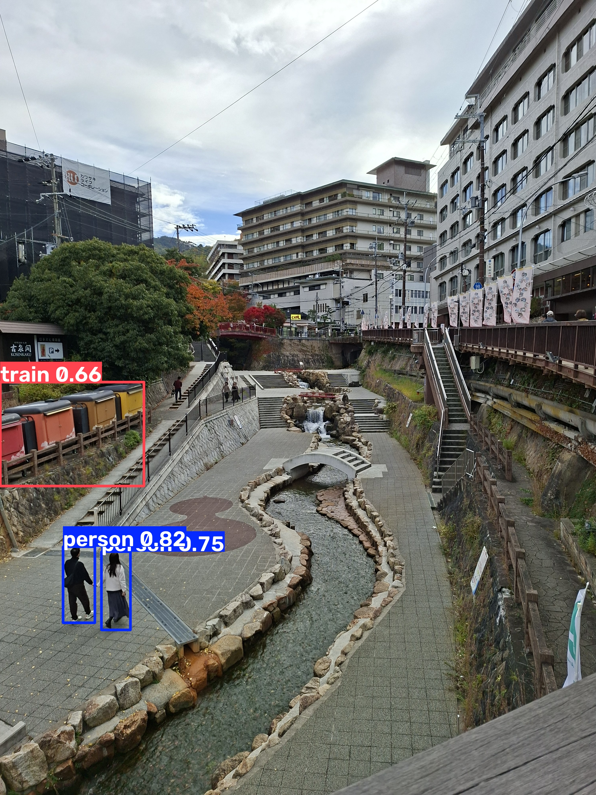
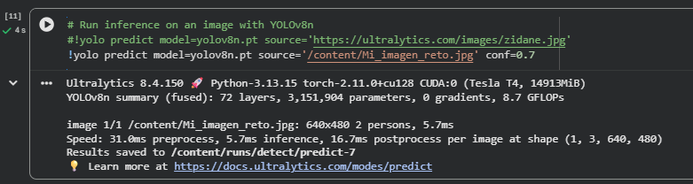
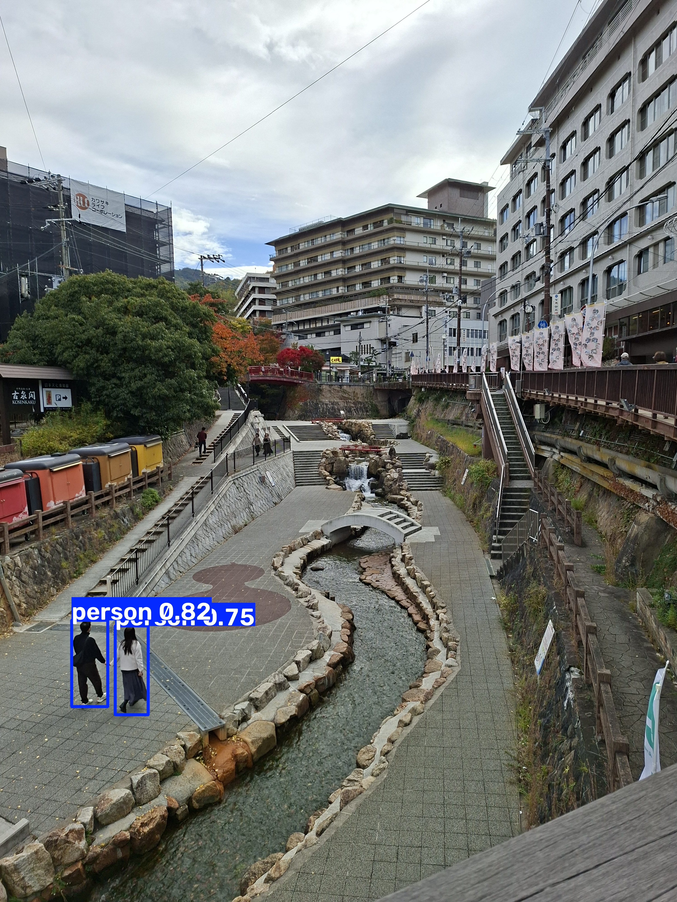
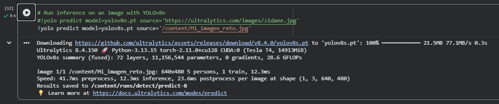
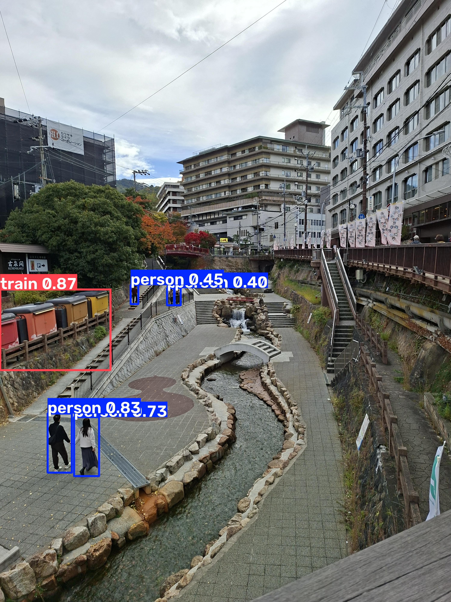
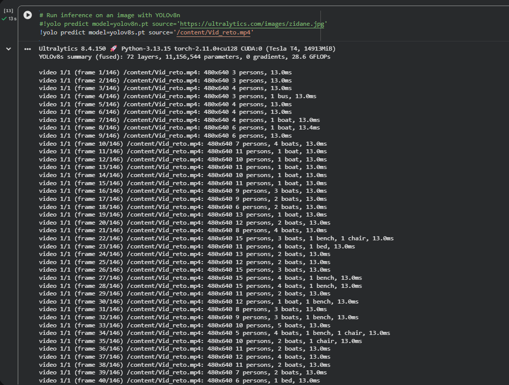
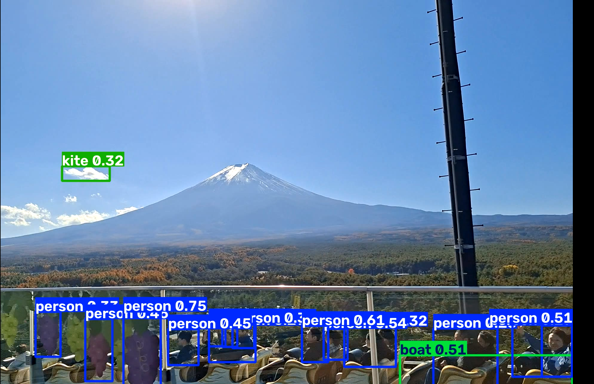
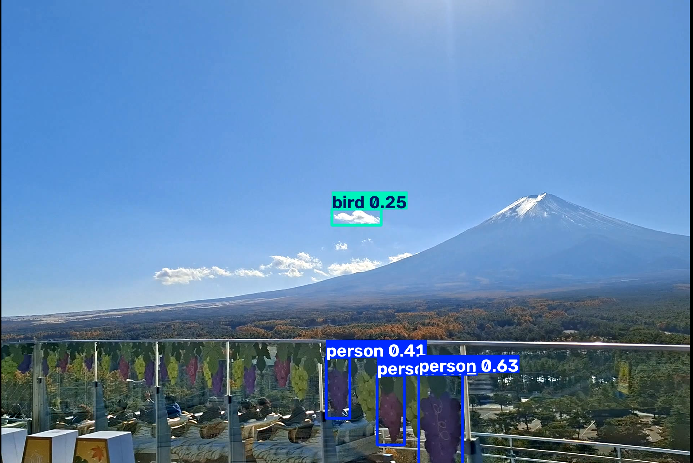
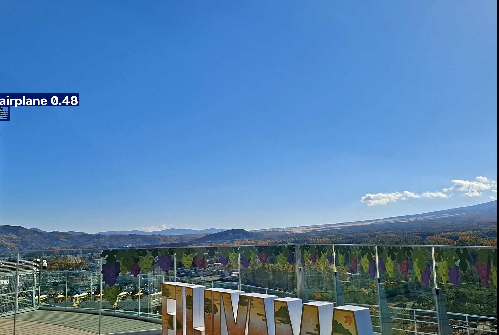
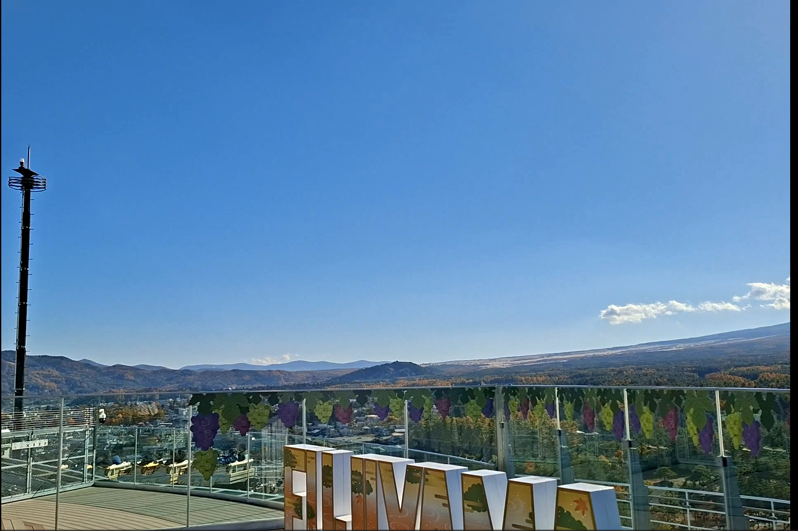

# Ejercicio 01 — Visison Computacional

## 1. Evidencias (enlace de Colab)

[📁 Códigos del ejercicio en Google Drive](https://drive.google.com/drive/folders/199SadvgxHq8oKewGfJfFaZIYivB0kDkW)

## 2. Salidas

[📁 Ver celdas](Celdas/)

| CLI original — `zidane.jpg`                                               | COCO128 — `bus.jpg`                                                               |
| ------------------------------------------------------------------------- | --------------------------------------------------------------------------------- |
|                       |                             |
| **CLI — Mi_Imagen**                                                       | **COCO128 — Mi_Imagen**                                                           |
|  |  |

## 3. Análisis y preguntas

### 3.1 ¿Qué clases detectó YOLO en las fotos de Ultralytics y cuáles en la tuya?

**Respuesta:** En la imagen de Zidane se detectan 2 clases [Person, Tie] en la imagen 2 personas y una corbata. En la imagen del autobús, se detectaron 3 clases [Person, Bus, Stop Sign] se ven 4 personas, un autobús y una señal de tránsito. En mi imagen se activan 2 clases [Person, Train] identificando 2 personas y un grupo de contenedores como un tren. 

### 3.2 ¿Algún objeto evidente de tu foto no salió etiquetado? ¿Por qué podría pasar (clase que no está en COCO, objeto chico, recorte, umbral de confianza)?

**Respuesta:** Hay 3 personas en el fondo de la imagen que se observan de manera clara, igualmente hay unas señales de tránsito del lado derecho de la imagen que tampoco reconoció. Una posible explicación es el hecho de que ambos grupos de objetos están bastante alejados y representan una porción muy pequeña del total de la imagen, lo que puede llevar a obtener un grado de confianza muy bajo que no activa el umbral para generar un Box.  

### 3.3 ¿La predicción de la celda CLI y la de model(...) coinciden sobre tu misma imagen?

**Respuesta:** En este caso en particular ambas predicciones coinciden exactamente, hasta en los valores de confianza tanto en las personas como en grupo de contenedores obtuvieron .82 y 75 (Person) y .66 (Train).

## 4. Evidencia de ejecucion en Colab.

 

## 5. Reto

### 5.1 En la misma imagen tuya, corre otra vez el CLI con umbral más estricto:

| **conf default — Mi_Imagen**                               | **conf 0.7 — Mi_Imagen**                             |
| ---------------------------------------------------------- | ---------------------------------------------------- |
|  |  |

##### 5.1.1 ¿Desaparecen cajas? ¿Cuáles?

**Respuesta:** Si, desaparece la caja de predicción del grupo de contenedores clasificada anteriormente como Train 0.66 por estar por debajo de nuestro nuevo umbral 0.70.

### 5.2 Cambia solo el modelo de la predicción CLI a yolov8s.pt (sin reentrenar) y mira si aparecen objetos que yolov8n se saltó:

| **V8n — Mi_Imagen**                           | **V8s — Mi_Imagen**                     |
| --------------------------------------------- | --------------------------------------- |
|  |  |

##### 5.2.1 ¿aparecen mas objetos?

**Respuesta:** Si, aparecen las personas que antes no se reconocían al fondo, adicionalmente, el valor de confianza de la predicción de Train aumento de .66 a .87.

### 5.3 Prueba un video corto:

[video procesado](Ejercicio_01/Videos/Vid_reto.avi)

| **Frame 1**                                | **Frame 2**                                | **Frame 3**                                | **Frame 4**                                |
| ------------------------------------------ | ------------------------------------------ | ------------------------------------------ | ------------------------------------------ |
|  |  |  |  |

##### 5.3.1 describe una escena en la que falle:

**Respuesta:** En la secuencia presentada arriba se pueden observar 2 posiciones en las que la predicción categoriza algo erróneamente en una clase. El Frame 1 detecta una nube con la clase “Kite” (0.32) y un asiento de montaña rusa como “Boat” (0.51). El Frame 2 detecta la misma nube ahora como “Bird” (0.25) y un vinil de un grupo uvas en un cristal como un grupo de “Person” (0.4, 0.63). El Frame 3 identifica lo que se puede observar en el Frame 4 como una luminaria publica como un “Airplane” (0.48).