# Ejercicio 01 — Clustering K-medias

## 1. Evidencias de ejecución

[📁 Códigos del ejercicio en Google Drive](https://drive.google.com/drive/folders/1z7yzHDtzibZEl6oWoooyBemL1JLlXG_h)

## 2. Implementación Original vs New

| Implementación Original                                 | Implementación Nueva                     |
| ------------------------------------------------------- | ---------------------------------------- |
| 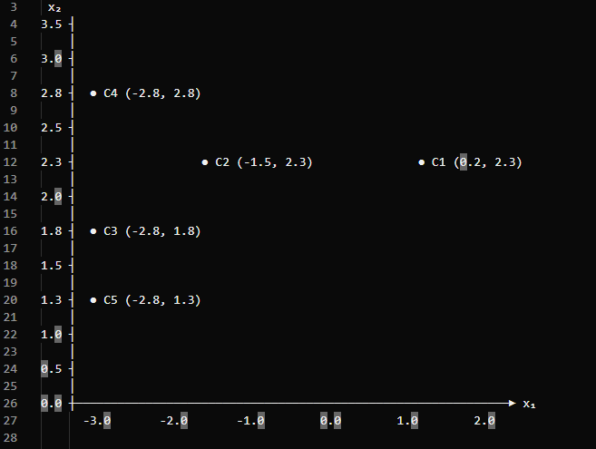 | 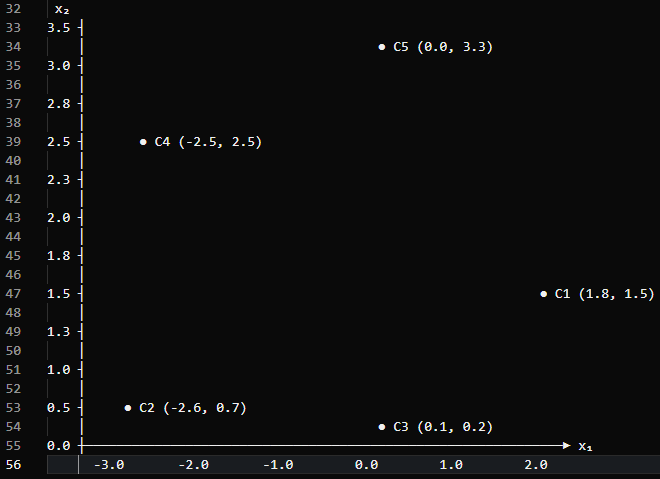 |

### 2.1 Configuración de centroides

| Centroide  | Original                  | New                       |
| ---------- | ------------------------- | ------------------------- |
| C1         | (0.2, 2.3)                | (1.8, 1.5)                |
| C2         | (-1.5, 2.3)               | (-2.6, 0.7)               |
| C3         | (-2.8, 1.8)               | (0.1, 0.2)                |
| C4         | (-2.8, 2.8)               | (-2.5, 2.5)               |
| C5         | (-2.8, 1.3)               | (0.0, 3.3)                |
| `blob_std` | (0.4, 0.3, 0.1, 0.1, 0.1) | (0.4, 0.3, 0.1, 0.1, 0.1) |

### 2.2 Distribución de los datos

A partir de los valores de centros en ambas implementaciones se generaron 2000 datos. a continuación, las gráficas de dispersión de los Data sets:

| Implementación Original                                     | Implementación New                           |
| ----------------------------------------------------------- | -------------------------------------------- |
| 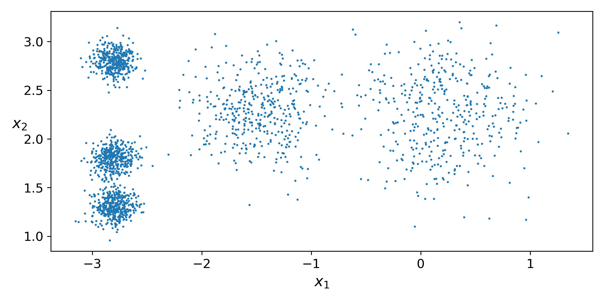 | 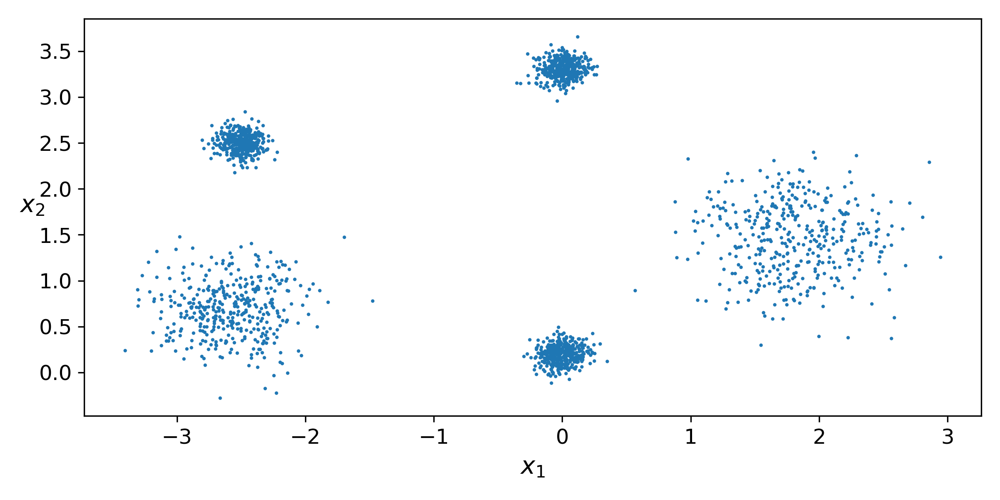 |

### 2.3 Diagrama de Voronoi

| Implementación Original                                     | Implementación New                           |
| ----------------------------------------------------------- | -------------------------------------------- |
|  | 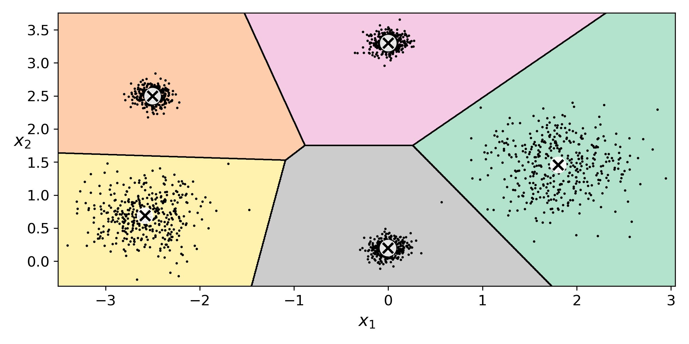 |

### 2.4 Comparación de inercia

`k=3`, `k=5` y `k=8` en ambas implementaciones.

| Número de clusters (k) | Original    | New         |
| ---------------------- | ----------- | ----------- |
| 3                      | 653.217     | 1839.512    |
| **5**                  | **224.074** | **215.355** |
| 8                      | 127.131     | 121.577     |

### 2.5 Método del codo

| Implementación Original                                 | Implementación New                       |
| ------------------------------------------------------- | ---------------------------------------- |
| 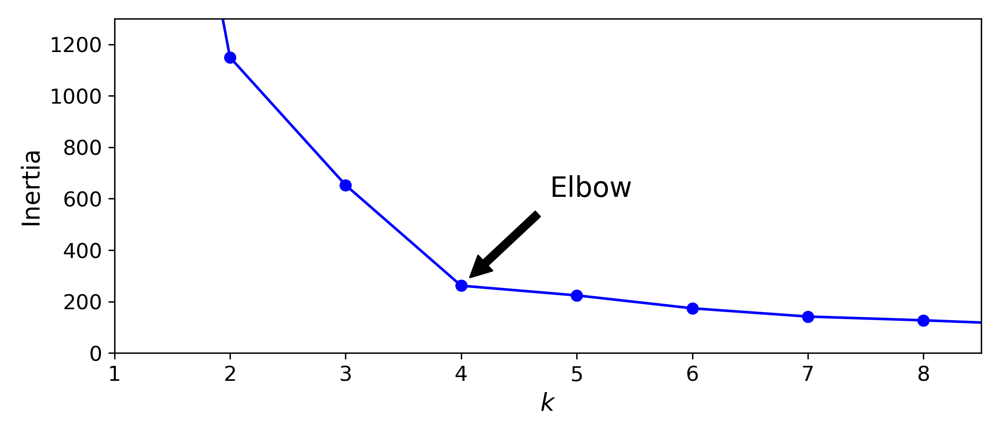 | 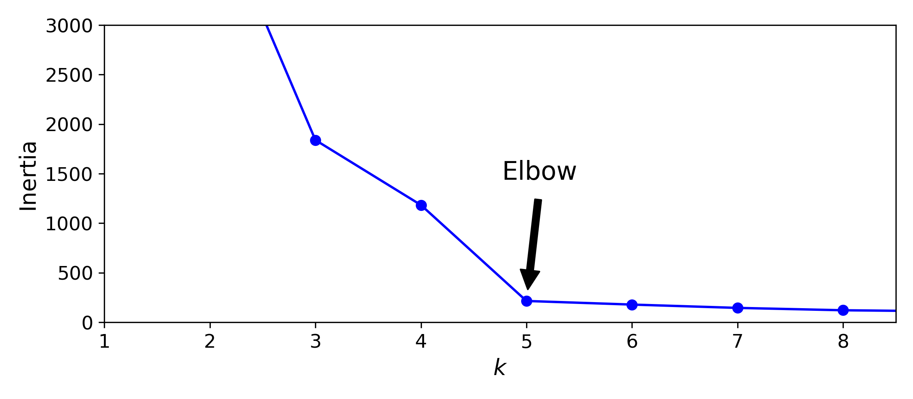 |

### 2.6 Coeficiente de silueta

| Implementación Original                                          | Implementación New                                 |
| ---------------------------------------------------------------- | -------------------------------------------------- |
| 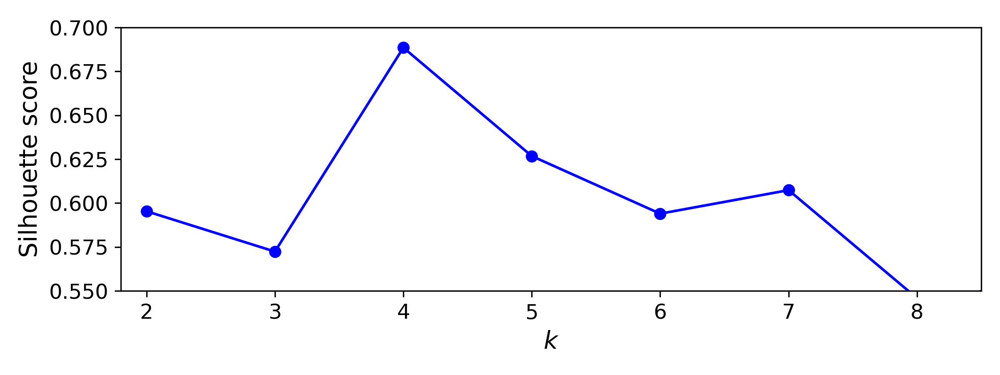 | 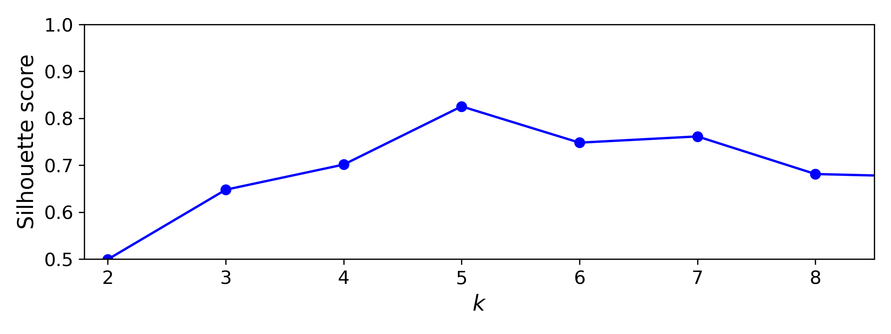 |

## 3. Preguntas de análisis

### 3.1 En los datos de Géron, ¿por qué el codo “prefiere” (k = 4) si `make_blobs` usó 5 centros?

[Respuesta] La manera en la que esta distribuida la geometría de nuestro Scatter nos puede dar una idea del porqué, C3 y C5 podrían representados considerablemente como un solo cluster en lugar de 2 separados por su cercanía en el plano. Adicionalmente, si observamos la grafica del codo de la implementación original la inercia de K= 2 es aproximadamente 1150, de ahí disminuye a 653.2 en K = 3 y posteriormente a aproximadamente 250 ya para K= 5 solo disminuye hasta 224.07. sí siguiéramos al pie de la letra el criterio del codo, se observaría que de K = 4 a K = 5 el cambio de inercia es menos significativo que de K = 3 a K = 4, por lo tanto, la selección de K4 parece razonablemente bien sostenida. 

### 3.2 Con tus blobs separados, ¿el codo y la silueta coinciden en el mismo (k)? ¿Ese (k) es 5?

[Respuesta] Si, cuando introducimos los nuevos centros para los blobs el codo y la silueta coinciden para K = 5.

### 3.3 Si el codo sigue en 4, ¿qué te falta mover (distancia entre centros vs. `blob_std`)?

[Respuesta] Si después de mover de introducir nuestros valores para los centros, el codo y la silueta convergiesen en K = 4, podríamos pensar que los cinco grupos de datos aun no son lo suficientemente distinguibles entre si, por lo que consideraría primero aumentar la distancia entre centros antes de modificar el Std.

## 4. Entorno de ejecución

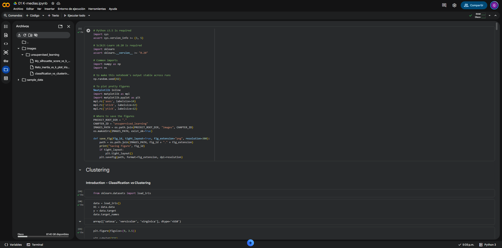

## 5. Reto

### 5.1 Deja los centros de Géron y **solo** sube los tres `std = 0.1` a `0.4`

#### Comparación de los datasets

| Implementación Original                                     | Reto                                            |
| ----------------------------------------------------------- | ----------------------------------------------- |
|  | 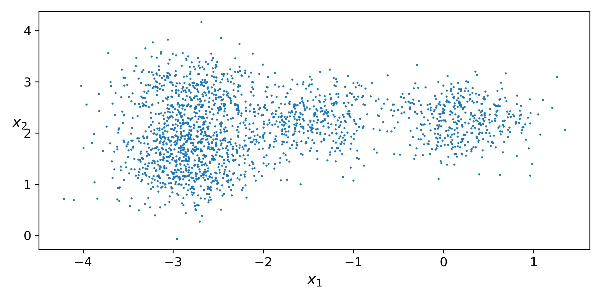 |

#### Método del codo

| Implementación Original                                 | Reto                                        |
| ------------------------------------------------------- | ------------------------------------------- |
|  | 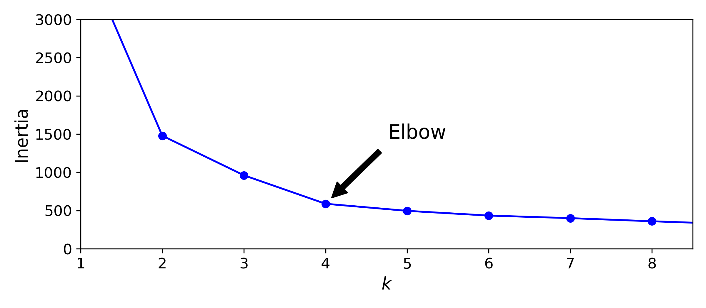 |

#### Coeficiente de silueta

| Implementación Original                                          | Reto                                                  |
| ---------------------------------------------------------------- | ----------------------------------------------------- |
|  | 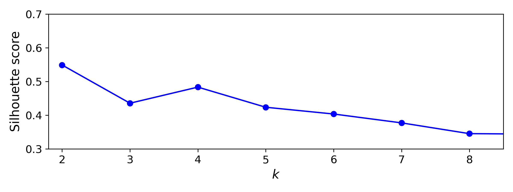 |

#### 5.1.1 ¿El codo se mueve igual que al **alejar** los centros?

[Respuesta] No, a diferencia de nuestro primer intento modificando las distancias de los centros, en esta implementación se mantuvo la predicción de K=4 para el codo de este Data set. Pareciera inclusive que se obtiene un efecto contrario pues algunos de los puntos de los clusters se mesclan entre ellos. 

### 5.2 Segmentación de imagen propia

En la última sección, sustituye `ladybug.png` por una imagen tuya y compara 10 / 8 / 6 / 4 / 2 colores. 

#### Segmentación de la imagen original

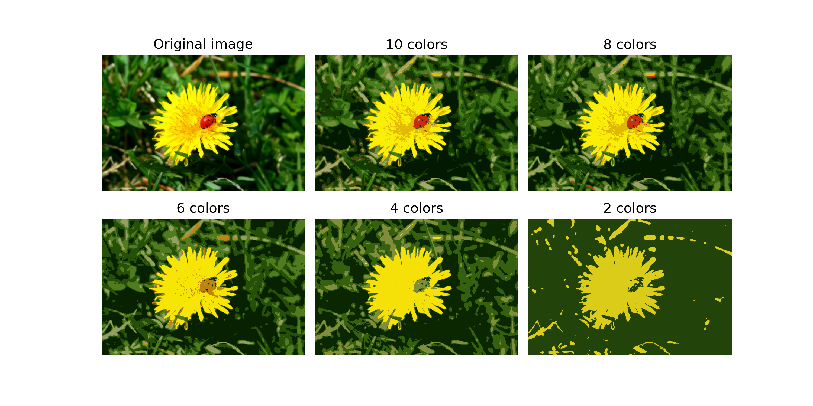

#### Segmentación de imagen propia

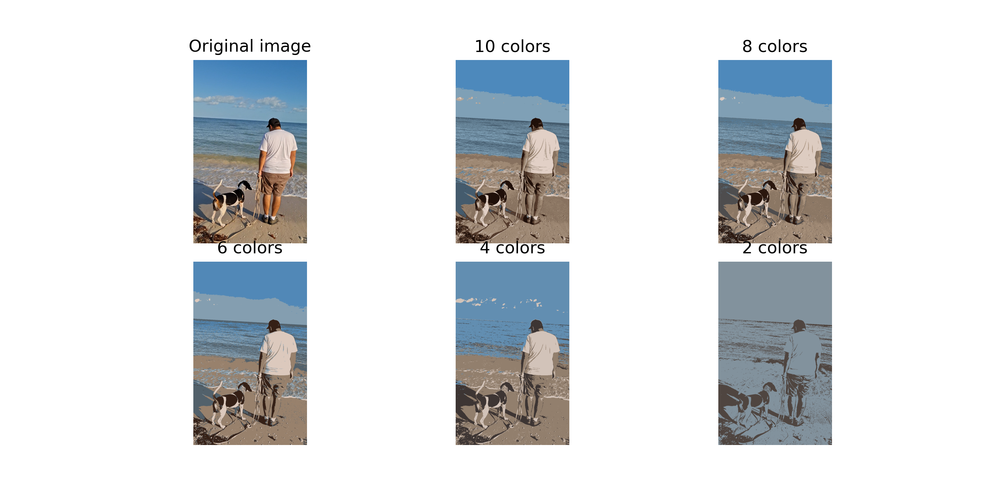

#### 5.2.1 ¿Con cuántos colores reconoces todavía el objeto?

[Respuesta] Como la imagen es bastante básica y no cuenta con demasiados elementos ni elementos pequeños, los personajes principales siguen siendo reconocibles incluso utilizando 2 colores. sin embargo, a medida que se reducen los colores se pueden perder algunos detalles de la imagen original.

### 5.3 K-Means sobre Iris

Corre el codo y la silueta sobre Iris (`X = data.data` de las primeras celdas, 4 atributos).

#### Distribución de Iris

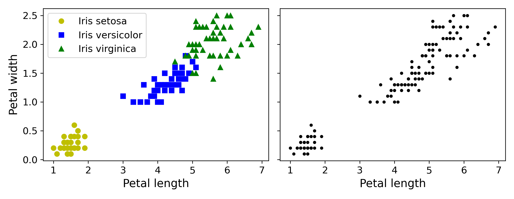

#### Evaluación del número de clusters

| Método del codo                             | Coeficiente de silueta                                |
| ------------------------------------------- | ----------------------------------------------------- |
| 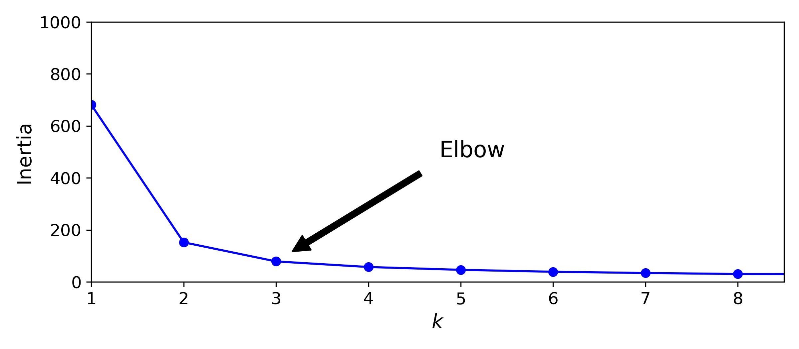 | 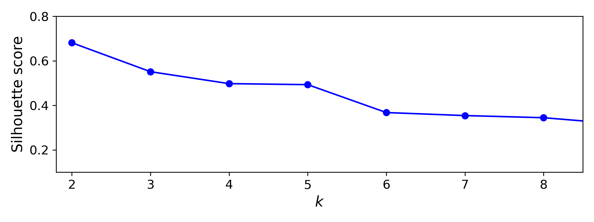 |

#### 5.3.1 ¿El `k` "bueno" coincide con las 3 especies? Relaciónalo con el scatter setosa vs. las otras dos.

[Respuesta] En este caso el codo es consistente con una K = 3, sin embargo, la silueta alcanza su valor máximo en K = 2 como. En el Scatter original de iris, podemos observar que el grupo de Setosa está claramente separado de un grupo bastante más próximo conformado por Versicolor y Virginica. Esto podría hacernos pensar como en el caso de la implementación original de blobs, que estos 2 grupos pudieran ser agrupados en un mismo Cluster. Desafortunadamente no podemos concluir de manera precisa a partir de este Scatter, ya que este es una representación 2d de 2 de las 4 características del Data set de Iris, y en Kmeans utilizo las 4 características para obtener tanto el codo como la silueta.